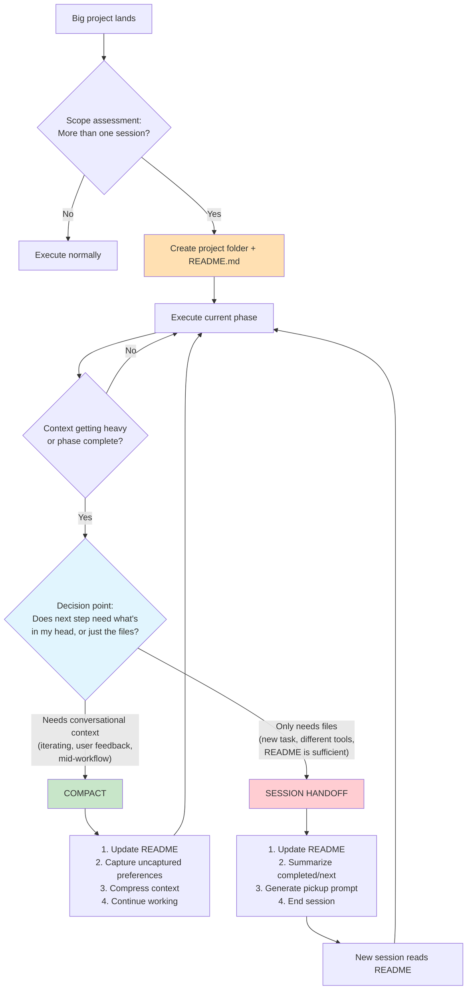

# Session Handoff & Compaction — Project Guide

## What This Tool Does

A Claude Code skill that manages context across long projects. It proactively splits big tasks into focused sessions, maintains a persistent README as the source of truth, and intelligently chooses between compaction (compress context in place) and session handoffs (clean break with pickup prompt) based on whether the next step needs conversational context or just the files.

## Architecture



The skill operates on a loop: assess scope → split into sessions → execute → decide compact vs. handoff → continue or start fresh.

## Installation

The skill is a single file. Copy it to your Claude Code skills directory:

```bash
mkdir -p ~/.claude/skills/session-handoff
cp skill/SKILL.md ~/.claude/skills/session-handoff/SKILL.md
```

## How It Works

Once installed, the skill triggers automatically when Claude Code detects:
- A project too big for one session
- Context getting long on complex work
- You asking to wrap up, compact, or continue later

It creates a project folder with a README.md that tracks:
- **Plan** — What the project is trying to accomplish
- **Status** — What's done, what's in progress, what's pending
- **Decisions** — Key choices made (so they don't get re-litigated)
- **Session log** — What each session accomplished and what the next one should do

## Key Rules

- The README is always the source of truth — not conversation history, not memory
- Never compact or end a session without updating the README first
- **Prefer compaction** when iterating on the same work — it preserves user feedback, preferences, and edge cases that a cold handoff would lose
- **Use handoffs** only at natural phase boundaries where the next task is genuinely different
- Be specific about next steps: file paths, exact commands, concrete first actions
- Decisions from previous sessions are respected unless the user explicitly revisits them
- Don't over-split — if it fits in 2-3 sessions with compaction, that's better than 5 handoffs

## Compact vs. Handoff Decision

**Rule of thumb:** If you could hand the README to a colleague and they'd know exactly what to do without asking you any questions, it's a new session. If they'd need to ask "wait, what did the user say about X?" — compact instead.

## Customizing

The skill works out of the box. If you want to adjust the README template, compact/handoff heuristics, or handoff format, edit `skill/SKILL.md` directly.
