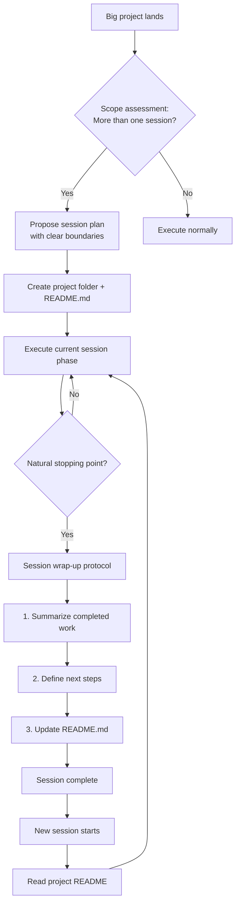

# Session Handoff — Project Guide

## What This Tool Does

A Claude Code skill that manages multi-session projects. It proactively splits big tasks into focused sessions, maintains a persistent project README as the source of truth, and generates clean handoff context so the next session picks up exactly where you left off.

## Architecture



The skill operates on a simple loop: assess scope → split into sessions → execute → handoff → next session reads README → continues.

## Installation

The skill is a single file. Copy it to your Claude Code skills directory:

```bash
mkdir -p ~/.claude/skills/session-handoff
cp skill/SKILL.md ~/.claude/skills/session-handoff/SKILL.md
```

## How It Works

Once installed, the skill triggers automatically when Claude Code detects:
- A project too big for one session
- You asking to wrap up or continue later
- Context getting long on complex work

It creates a project folder with a README.md that tracks:
- **Plan** — What the project is trying to accomplish
- **Status** — What's done, what's in progress, what's pending
- **Decisions** — Key choices made (so they don't get re-litigated)
- **Session log** — What each session accomplished and what the next one should do

## Key Rules

- The README is always the source of truth — not conversation history, not memory
- Never end a session without updating the README
- Be specific about next steps: file paths, exact commands, concrete first actions
- Decisions from previous sessions are respected unless the user explicitly revisits them
- Don't over-split — if it fits in 2-3 sessions, that's fine

## Customizing

The skill works out of the box. If you want to adjust the README template, session boundary heuristics, or handoff format, edit `skill/SKILL.md` directly.
