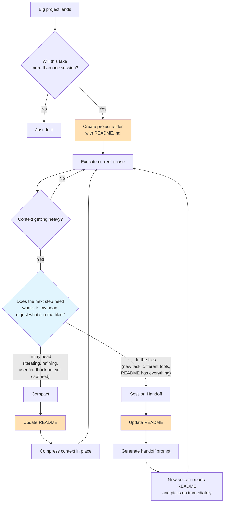

# Session Handoff & Compaction

Built by [Andy Toizer](https://www.linkedin.com/in/andy-toizer/) — I'm the head of growth at [Freckle.io](https://freckle.io) and write [AgentOperator](https://agentoperator.substack.com), a newsletter about what it actually looks like to build real systems with coding agents as a non-engineer.

**TLDR:** A Claude Code skill that keeps context tight across long projects — either by compacting within a session or handing off cleanly between sessions. It maintains a persistent README as the source of truth so no work gets lost.

It came from running multi-session outbound campaigns, data pipeline builds, and tooling projects where context kept getting lost between conversations. After rebuilding the same context three times, I turned the pattern into a skill. Later, I realized most "session handoffs" should actually be compactions — you only need a new session when the task genuinely changes.

## The Problem

When a project takes more than one Claude Code session, every new session starts cold. You re-explain context, re-make decisions, and waste time getting back to where you were. But starting a new session isn't always the right move — sometimes you just need to compress what you have and keep going.

## How It Works



The skill does four things:

1. **Proactive splitting** — When you bring a big project, it assesses the scope and proposes session boundaries before starting.

2. **Persistent state** — Creates a project folder with a README.md that tracks everything: plan, status, decisions, and a session log. This is the single source of truth.

3. **Smart context management** — When context gets heavy, it decides whether to compact (preserve nuance, keep working) or hand off (clean break, fresh start). The decision framework is simple: if a colleague could pick up from the README alone, it's a new session. If they'd need to ask "what did the user say about X?", compact instead.

4. **Clean handoffs** — When a new session is the right call, it generates a ready-to-paste prompt so the next session reads the README and hits the ground running.

## When to Compact vs. New Session

| Compact | New Session |
|---------|-------------|
| Iterating on the same work (refining, re-running with tweaks) | Starting a genuinely different task with different tools |
| User gave feedback you haven't captured in files yet | Everything needed is in the README + data files |
| Mid-loop — not at a natural stopping point | At a clear phase boundary |
| Tool state and working context matter | Current context would just be noise |
| Next step is a continuation | Next step has its own setup and iteration loop |

**Rule of thumb:** If you could hand the README to a colleague and they'd know exactly what to do without asking you questions, it's a new session. If they'd need to ask "wait, what did the user say about X?" — compact.

## What a Project README Looks Like

```markdown
# EdTech Outbound Campaign

## Overview
Targeted outbound to 200 companies for Freckle...

## Status Tracker
### Phase 1: Build Company Lists ← COMPLETED
- [x] Apollo org searches
- [x] AI Ark API client built and tested

### Phase 2: Find People ← CURRENT
- [x] Apollo search — 1,689 contacts across 157 domains
- [x] AI Ark enrichment — 887 matched
- [ ] Email enrichment waterfall

## Decisions Made
1. Hybrid approach: Apollo → AI Ark → Web Search
2. C-suite deprioritized at 500+ employee companies
3. Product marketing excluded from marketing leader segment

## Session Log
### Session 1 — 2026-04-15
**Completed:** Built AI Ark client, collected 300 raw companies
**Next:** Curate to 100 per vertical using AI Ark lookalike search
```

## Install

Copy the skill to your Claude Code skills directory:

```bash
# Clone the repo
git clone https://github.com/andytoizer/session-handoff
cd session-handoff

# Copy to your skills directory
mkdir -p ~/.claude/skills/session-handoff
cp skill/SKILL.md ~/.claude/skills/session-handoff/SKILL.md
```

Or if you just want the file:

```bash
mkdir -p ~/.claude/skills/session-handoff
curl -o ~/.claude/skills/session-handoff/SKILL.md \
  https://raw.githubusercontent.com/andytoizer/session-handoff/main/skill/SKILL.md
```

That's it. Claude Code will automatically use the skill when it detects a multi-session project.

## When It Triggers

The skill activates when:
- You start a project that will clearly take more than one session
- Context is getting long on a complex task
- You say things like "let's split this up" or "we'll continue next time"
- You've completed a phase and the next one is genuinely different work

It also triggers proactively — if Claude recognizes the scope is too big for one session, it'll propose a plan without you asking. And when context gets heavy mid-session, it'll suggest compacting rather than forcing a session break.

## Good Handoff vs Bad Handoff

**Good:**
> **Completed:** Built and tested the API client. People search works with domain + seniority filters. Raw data collected: 156 EdTech + 166 ConstructionTech companies.
>
> **Next session should:**
> 1. Read `campaigns/README.md` for full context
> 2. Curate EdTech list to 100 using lookalike search seeded from ClassDojo
> 3. Filter ConstructionTech — Apollo returned actual construction firms, not software companies

**Bad:**
> We made good progress. Next time we should keep working on it.

The difference is specificity. File paths, numbers, exact next steps.

## License

MIT — use it, fork it, improve it. If you build something cool, [let me know](mailto:andy@freckle.io).
