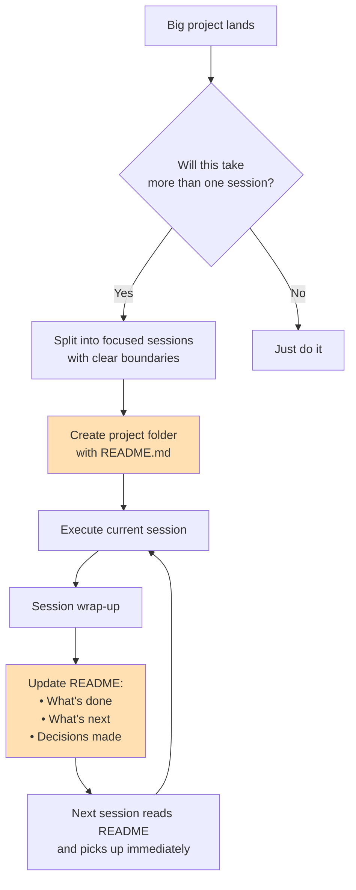

# Session Handoff

Built by [Andy Toizer](https://www.linkedin.com/in/andy-toizer/) — I'm the head of growth at [Freckle.io](https://freckle.io) and write [Agent Operator](https://agentoperator.substack.com), a newsletter about what it actually looks like to build real systems with coding agents as a non-engineer.

**TLDR:** A Claude Code skill that splits big projects into focused sessions, keeps a persistent README as the source of truth, and generates clean handoff context so the next session picks up exactly where you left off.

It came from running multi-session outbound campaigns, data pipeline builds, and tooling projects where context kept getting lost between conversations. After rebuilding the same context three times, I turned the pattern into a skill.

## The Problem

When a project takes more than one Claude Code session, every new session starts cold. You re-explain context, re-make decisions, and waste time getting back to where you were. The longer the project, the worse it gets.

## How It Works



The skill does three things:

1. **Proactive splitting** — When you bring a big project, it assesses the scope and proposes session boundaries before starting. Each session has a clear deliverable and a natural stopping point.

2. **Persistent state** — Creates a project folder with a README.md that tracks everything: plan, status, decisions, open questions, and a session log. This is the single source of truth.

3. **Clean handoffs** — At the end of each session, it summarizes what's done, what's next (specific first steps, not vague descriptions), and updates the README so a fresh session can read it and hit the ground running.

## What a Project README Looks Like

```markdown
# EdTech Outbound Campaign

## Overview
Targeted outbound to 200 companies for Freckle...

## Status Tracker
### Phase 1: Build Company Lists ← COMPLETED
- [x] Apollo org searches
- [x] AI Ark API client built and tested

### Phase 2: Find People ← CURRENT
- [ ] Segment A & B: AI Ark people search
- [ ] Segment C: Sales Nav queries

## Decisions Made
1. AI Ark for people search, not Apollo (better filters, no credit limit)
2. Email enrichment waterfall: Lead Magic → Prospeo → FindEmail

## Session Log
### Session 1 — 2026-04-08
**Completed:** Built AI Ark client, collected 300 raw companies from Apollo
**Next:** Curate to 100 per vertical using AI Ark lookalike search
```

## Install

Copy the skill to your Claude Code skills directory:

```bash
# Clone the repo
git clone https://github.com/andytoizer/session-handoff
cd session-handoff

# Copy to your skills directory
mkdir -p ~/.claude/skills/session-handoff
cp skill/SKILL.md ~/.claude/skills/session-handoff/SKILL.md
```

Or if you just want the file:

```bash
mkdir -p ~/.claude/skills/session-handoff
curl -o ~/.claude/skills/session-handoff/SKILL.md \
  https://raw.githubusercontent.com/andytoizer/session-handoff/main/skill/SKILL.md
```

That's it. Claude Code will automatically use the skill when it detects a multi-session project.

## When It Triggers

The skill activates when:
- You start a project that will clearly take more than one session
- You say things like "let's split this up" or "we'll continue next time"
- Context is getting long on a complex task
- You're wrapping up and want to continue later

It also triggers proactively — if Claude recognizes the scope is too big for one session, it'll propose a split without you asking.

## Using Claude Code (recommended)

Open any project in [Claude Code](https://claude.ai/claude-code) with this skill installed. Start describing a big project and the skill will kick in automatically. You don't need to reference it explicitly.

## Good Handoff vs Bad Handoff

**Good:**
> **Completed:** Built and tested the API client. People search works with domain + seniority filters. Raw data collected: 156 EdTech + 166 ConstructionTech companies.
>
> **Next session should:**
> 1. Read `campaigns/README.md` for full context
> 2. Curate EdTech list to 100 using lookalike search seeded from ClassDojo
> 3. Filter ConstructionTech — Apollo returned actual construction firms, not software companies

**Bad:**
> We made good progress. Next time we should keep working on it.

The difference is specificity. File paths, numbers, exact next steps.

## License

MIT — use it, fork it, improve it. If you build something cool, [let me know](mailto:andy@freckle.io).
